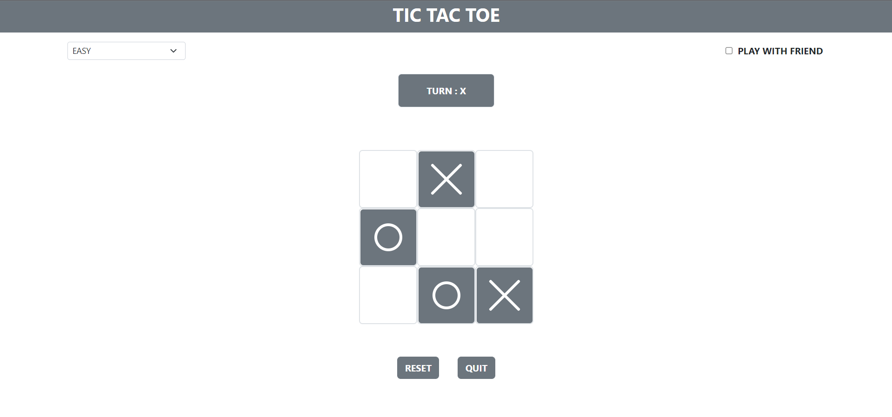

# Tic-Tac-Toe


>   This tic tac toe game, you can play with computer or with with  friend.
>
>   Technology used : HTML, CSS, JavaScript, Bootstrap



### How to use

-   Download code <a href="https://github.com/Viral-Gajera/Tic-Tac-Toe/archive/refs/heads/master.zip" > zip file </a>

-   Make sure that you have installed node.js

-   Execute following command to terminal

    ```
    npm install
    ```

    By exetuting this command you will get all bootstrap file with the help of package.json

-   open index.html